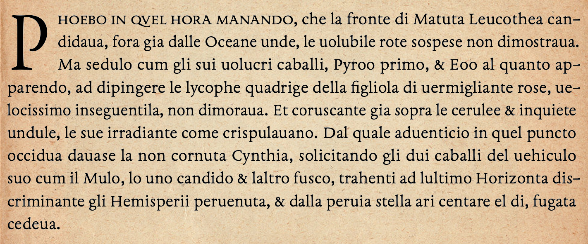

Irradiant is an antiqua font based on typefaces by Francesco Griffo, punchcutter to Aldus Manutius in the late fifteenth and early sixteenth centuries. Irradiant (the name is a word from the first chapter of the 1598 English translation of Francesco Colonna, *Hypnerotomachia Poliphili*, published by the Aldine Press in 1499) is intended for modern and especially informal uses, for example, fiction, magazines, and many websites. With a generous selection of Latin, Cyrillic, and Greek characters, it supports well over 300 languages, including English, French, Italian, Spanish, German, Ukrainian, Russian, and Greek (ancient and modern), along with numerous other languages, e.g. Bulgarian, Dutch, Basque, Albanian, Czech, Icelandic, Polish, Niuean, Pogolo, Taita, and Tuvalu (drag one of the font files into [Shaperglot](https://googlefonts.github.io/shaperglot/) for a complete list). Support for other languages may be added if users request it.

The first (and latest) release of Irradiant is [https://github.com/psb1558/Irradiant-font/releases](version 0.001). Like most early software versions, it is likely to exhibit bugs and design errors. If you encounter any, please leave an issue on this site.

Photo: *Sunset over the Blue Ridge*, by P. Baker.
