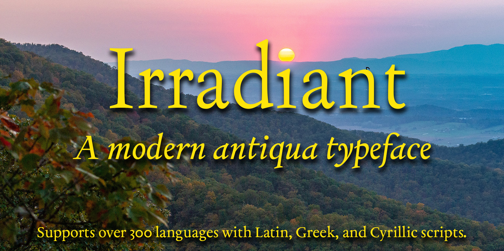

Coming soon: an antiqua font based on typefaces by Francesco Griffo, punchcutter to Aldus Manutius in the late fifteenth and early sixteenth centuries. Irradiant (the name is a word from the first chapter of the 1598 English translation of Francesco Colonna, *Hypnerotomachia Poliphili*, published by Aldus Manutius in 1499) is intended for modern and especially informal uses, for example, fiction, magazines, and websites. With a generous selection of Latin, Cyrillic, and Greek characters, it supports well over 300 languages, including English, French, Italian, Spanish, German, Ukrainian, Russian, and Greek (ancient and modern), along with numerous other languages, e.g. Bulgarian, Dutch, Basque, Albanian, Czech, Icelandic, Polish, Niuean, Pogolo, Taita, and Tuvalu (drag one of the font files into [Shaperglot](https://googlefonts.github.io/shaperglot/) for a complete list). Support for other languages may be added if users request it.

There will be a release when the font is more mature—probably in late spring or summer 2025. In the meantime, check out the [sampler and feature list](https://github.com/psb1558/Irradiant-font/blob/master/docs/IrradiantManual.pdf) for the font. Users who are able can generate Irradiant using either the [Glyphs font editor](https://glyphsapp.com/) or Google's [fontmake](https://github.com/googlefonts/fontmake). It is suggested that you generate either static autohinted `.otf` fonts (with CFF outlines) or variable `.ttf` fonts.
